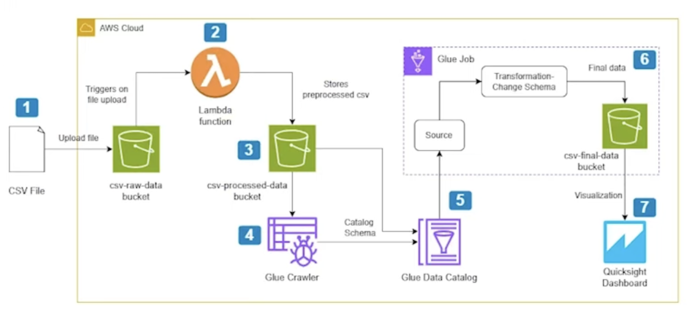

# 🚀 Serverless CSV Data Visualization Pipeline with AWS 📊

This project demonstrates a fully serverless data pipeline on AWS. It ingests raw CSV files, processes them through a series of transformations, and makes the final, analysis-ready data available for visualization in Amazon QuickSight.

The entire architecture is event-driven and built on managed services, minimizing operational overhead and enabling scalability.

---

## 🏛️ Architecture Overview

The pipeline follows a staged approach, moving data through different S3 buckets as it gets progressively cleaned and transformed.

### Step-by-Step Data Flow:

1.  **📥 Ingestion (S3 Raw Bucket):**
    *   A user or automated process uploads a raw CSV file to the `csv-raw-data` S3 bucket. This action is the trigger for the entire pipeline.

2.  **🤖 Initial Processing (AWS Lambda):**
    *   The S3 upload event automatically triggers a Python-based AWS Lambda function.
    *   This function performs initial, lightweight processing such as basic validation, cleaning, or reformatting.
    *   It then writes the processed CSV file to the `csv-processed-data` S3 bucket.

3.  **📚 Schema Detection (AWS Glue Crawler):**
    *   An AWS Glue Crawler is configured to run on the `csv-processed-data` bucket.
    *   The crawler automatically scans the data, infers its schema (column names, data types, etc.), and creates or updates a table in the AWS Glue Data Catalog. This makes the S3 data "queryable" for other services.

4.  **✨ Transformation (AWS Glue ETL Job):**
    *   An AWS Glue ETL job (running a PySpark script) reads the data from the Glue Data Catalog table created by the crawler.
    *   This is where the heavy lifting and main business logic are applied:
        *   Renaming columns for clarity.
        *   Changing data types (e.g., from string to double).
        *   Filtering out unnecessary rows or columns.
        *   Performing aggregations or joins with other datasets (if needed).
    *   The job writes the final, transformed data in a columnar format like **Apache Parquet** to the `csv-final-data` S3 bucket. Parquet is highly efficient for analytical queries.

5.  **📈 Visualization (Amazon QuickSight):**
    *   Amazon QuickSight connects to the final dataset. The recommended and most powerful way to do this is by using **Amazon Athena** as a query engine on top of the Glue Data Catalog table that points to the final Parquet data in S3.
    *   This connection allows for the creation of interactive dashboards and reports for business intelligence and data analysis.

---

## 📁 Project Files

This folder contains the core code and data files required to configure the pipeline.

### `sample_input.csv` 📄

This is a sample CSV data file. Uploading this file to the raw data S3 bucket will trigger the entire pipeline.

### `lambda_function.py` 🐍

This Python script contains the code for the AWS Lambda function. It handles the initial processing step.

### `glue_etl_job.py` ✨

This is the Python Spark (PySpark) script for the AWS Glue ETL job. It performs the main data transformations.

### `quicksight_manifest.json` 📝

This is an optional manifest file used only if you want to connect Amazon QuickSight *directly* to the final S3 bucket, bypassing the recommended Athena query layer. It tells QuickSight where to find the data files and their format.
